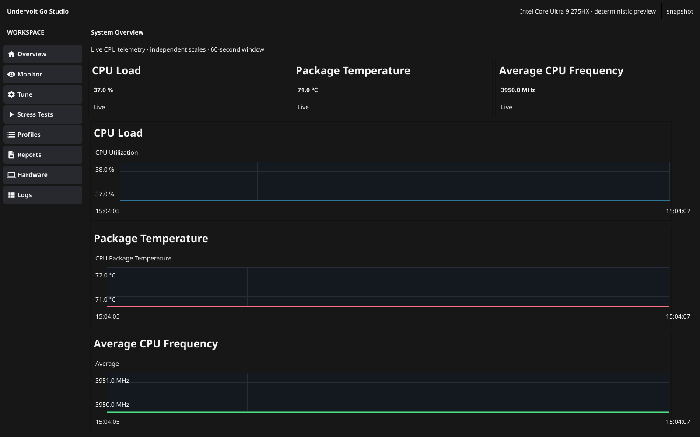
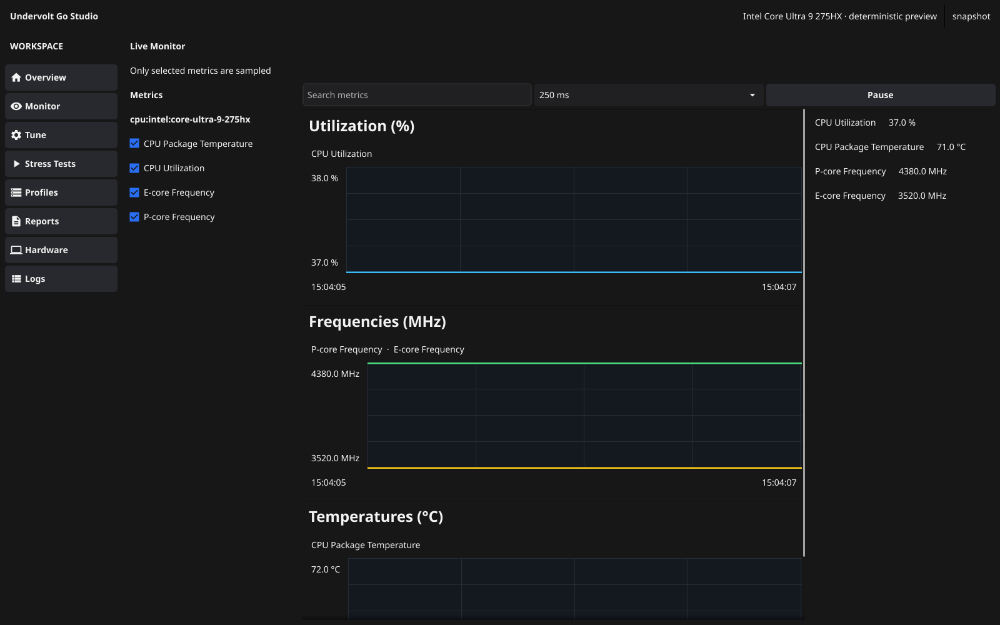
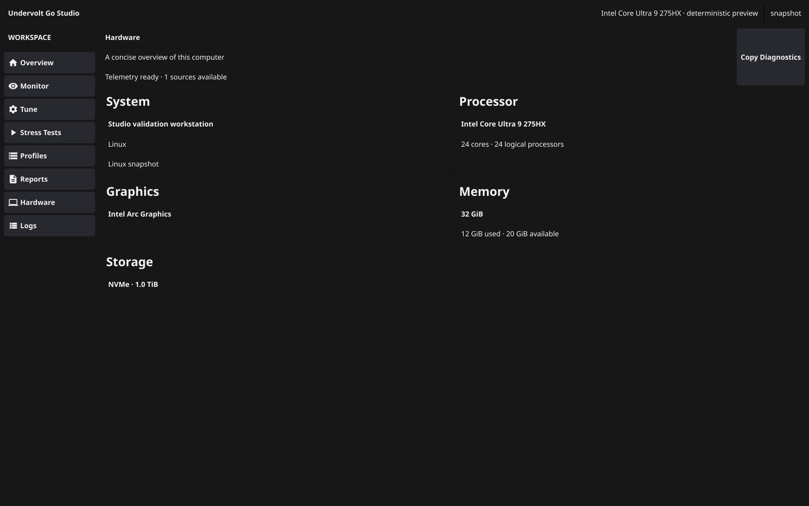
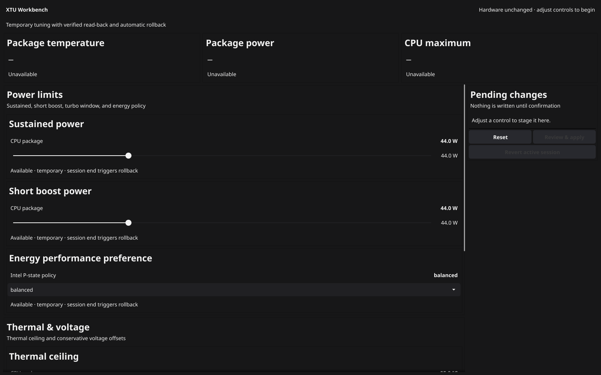

# Undervolt Go Studio

Undervolt Go Studio is a Linux workstation for live CPU telemetry and carefully staged, temporary Intel tuning.



Studio keeps monitoring in the normal-user GUI, creates pages only when they are opened, and starts the narrow privileged helper only after a reviewed tuning action is confirmed. Current screens cover live telemetry, machine inventory, and a capability-driven Tune workbench.

## Overview


Overview presents CPU load, package temperature, and average CPU frequency on independent 60-second charts. It subscribes only to its summary metrics while the page is visible.

## Monitor



Monitor lets you select the metrics to sample, choose an interval from 100 ms to 5 s, pause collection, and compare unit-specific charts without turning inactive pages into background pollers.

## Hardware



Hardware summarizes the system, processor, graphics, memory, storage, and telemetry-provider readiness. The documentation capture uses a deterministic Intel Core Ultra 9 275HX scenario rather than the reader's computer.

## Tune



Tune stages changes locally and requires review before authorization. Applied results show Requested and Verified values. Unsupported controls remain visible with an explanation. The screenshots use deterministic demonstration values, not a hardware-validation result.

## Capability status

| Capability | Status | Notes |
| --- | --- | --- |
| Overview, Monitor, and Hardware telemetry | Implemented | Normal-user GUI with visible-page subscriptions. |
| Tune staging, review, temporary apply, and rollback | Implemented | Semantic controls, read-back verification, and a short-lived helper session. |
| PL1, PL2, EPP, and TCC | Hardware-dependent | Kernel-backed controls; power targets use practical 1 W review increments and require exact read-back. |
| Turbo time window (Tau) | Read-only | Sysfs microseconds do not establish the hardware's representable time windows. |
| P-core ratios and core/cache voltage offsets | Read-only | Writability, lock state, and stock restoration cannot yet be established safely, including on the 275HX. Tested codecs do not authorize production writes. |
| E-core ratios | Read-only | The register layout remains unverified. |
| Stress Tests, Profiles, Reports, GPU telemetry, and packaged releases | Planned | These are not complete in the current Studio milestone. |

## Temporary tuning safety

Temporary tuning is staged first and changes nothing until review confirmation starts the fixed helper command. One helper or mutating harness owns the recovery lock at a time. The helper saves recovery state before writes, checks capability drift immediately before applying, verifies read-back, and attempts rollback on explicit revert, GUI close, pipe loss, lease expiry, or a transaction failure.

Incomplete restoration stays visible with verified remaining values (or an explicit unverified state), Retry rollback / recovery, and reboot guidance. Closing the window stops if restoration cannot be confirmed. An unresolved recovery record blocks new tuning; records from another boot require an audit instead of replaying volatile settings.

A kernel panic, power loss, or hard lock cannot be repaired by a running user-space process. If the machine hard-locks, reboot is the recovery path; volatile MSR settings are expected to reset, and the next helper session rechecks kernel-backed controls before another apply.

## Supported environment and 275HX validation

Studio targets Linux systems with the kernel interfaces needed by each advertised capability. The current validation target is the Intel Core Ultra 9 275HX (GenuineIntel family 6, model `0xC6`, stepping 2). The recorded read-only probe establishes interface availability; it does not prove voltage writability, firmware lock state, or safe hardware restoration. No hardware mutation was performed for the final safety fixes. Mutating validation remains an opt-in developer procedure, not a release claim.

## Build and run

The Studio GUI itself is unprivileged:

```bash
go test ./...
go build -o build/undervolt-go-studio ./cmd/studio
./build/undervolt-go-studio
```

Build the separately inspectable packaged-helper artifact with:

```bash
go build -o build/undervolt-go-studio-helper ./cmd/helper
```

Distribution packaging installs that helper at its fixed policy-controlled path. Studio does not download helpers or use a shell to invoke them; no packaged release is currently published.

## Further reading

- [Studio design](docs/superpowers/specs/2026-09-11-undervolt-go-studio-design.md)
- [Intel tuning backend design](docs/superpowers/specs/2026-09-11-intel-tuning-backend-design.md)
- [275HX validation runbook](docs/validation/intel-275hx-runbook.md)
- [275HX read-only verification](docs/validation/intel-275hx-read-only.md)
- [GPL-3.0 license](LICENSE.txt)

Forked from [Softorage/undervolt-go](https://github.com/Softorage/undervolt-go). Original history and authorship are retained.
